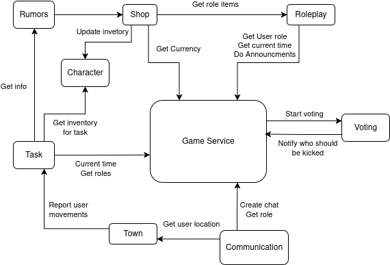

# Mafia-District

## Definitions / roles

- **Career** - refers to in-game profession which maybe assigns role-specific tasks
- **Vampires** – Equivalent to the Mafia role. They work together secretly at night to eliminate other players and aim to outnumber or overpower the townsfolk. Their strength lies in coordination and secrecy.

- **Sheriff** – A town investigative role. The Sheriff can check a player’s alignment during the night phase, attempting to reveal Mafia (Vampires) members. The role is crucial for guiding daytime voting.

- **Alchemist** – A town protective role. The Alchemist uses potions or remedies each night to safeguard a chosen player from harm. If the Vampires target that player, the Alchemist’s protection prevents the elimination.

- **Villager** – A basic town-aligned role with no special powers. Villagers rely on discussion, deduction, and voting during the day phase to identify and exile the Mafia (Vampires). Their strength lies in numbers and collective reasoning.

## **Service Boundaries**

The following sections describe the key services and their responsibilities within the system.

### **1. User Management Service**

- **Responsibilities:**
  - Manages user information
  - Associates the user’s profile with device and location information
  - Ensures that each player can create and manage a single profile
- **Data Stored:**
  - ID
  - Email
  - Username
  - Password
  - Device and location info

---

### **2. Game Service**

- **Responsibilities:**
  - Manages the primary game logic, including the Day/Night cycle and event notifications (kill/heal/rumor/visiting place)
  - Tracks player status (alive/dead, role, career) in each game lobby (till 30 players)
  - Initiates voting each night and tracks voting results. Also provides the list people that can be voted
  - In-game currency
- **Data Stored:**
  - Player status (alive/dead)
  - Player roles, career info and in-game currency

---

### **3. Shop Service**

- **Responsibilities:**
  - Allows players to buy in-game items using their currency
  - Balance in item quantities
  - Items available for purchase may include special items like garlic or water, used for defense or task completion
- **Data Stored:**
  - Item inventory
  - Player purchases
  - Transaction history

---

### **4. Roleplay Service**

- **Responsibilities:**
  - Manages the functionality of each in-game role and their specific abilities (Mafia ability to kill, Sheriff’s ability to guess roles)
  - Tracks and records actions performed by players according to their roles
  - Sends filtered announcements regarding player actions (e.g., murders, guesses) (probably send announcements to Game Service and Game Service to users)
  - Handle role/ability for items
- **Data Stored:**`
  - Roles
  - Roles actions
  - Announcements related to actions

---

### **5. Town Service**

- **Responsibilities:**
  - Contains all locations within the town, including the Shop and Informator Bureau
  - Tracks and records player movements within the town
  - Reports player movements to the Task Service 1for task-related actions
- **Data Stored:**
  - Location data
  - Player movement logs

---

### **6. Character Service**

- **Responsibilities:**
  - Allows players to customize their in-game characters
  - Monitors the player’s inventory of purchased items from the Shop
  - Manages customization options such as hair, clothing, and accessories
- **Data Stored:**
  - Customization options (e.g., hairstyle, coat)
  - Inventory items purchased

---

### **7. Rumors Service**

- **Responsibilities:**
  - Provides players with the option to buy random pieces of information using in-game currency
  - Information may reveal roles, tasks, or physical appearance of other players
  - Information availability varies based on player role and actions in the game
- **Data Stored:**
  - Rumor information
  - Currency transaction for rumors

---

### **8. Communication Service**

- **Responsibilities:**
  - Manages global chat for the town during voting hours
  - Supports private chat between specific groups (e.g., Mafia members or players located in the same area)
- **Data Stored:**
  - Chat messages
  - User chat history

---

### **9. Task Service**

- **Responsibilities:**
  - Assigns daily tasks to players based on their roles and careers
  - Players earn in-game currency by completing tasks
  - Tasks may require players to use specific items, visit locations, or interact with players
  - Some tasks may result in rumors being generated
- **Data Stored:**
  - Task assignments
  - Player task completions
  - Rumor generation

---

### **10. Voting Service**

- **Responsibilities:**
  - Collects and counts votes during the evening voting phase
  - Tracks which players voted for which others and calculates the final voting result
  - Notifies the Game Service about the exiled player after voting
- **Data Stored:**
  - Vote counts
  - Voting history (who voted for whom)

---

# Technologies

## User Management & Game Service

### Technology Stack

- **Language**: Go
- **Framework**: Golang Standard Library
- **Communication Pattern**: RESTful API or gRPC

### Trade-offs

- **Pros**: Go's is simple, lightweight both in terms of CPU and memory usage, robust ecosystem, and built in concurrency support
- **Cons**: Verbose error handling, slower to iterate on than a language like Python or Javascript

---

## Shop Service

### Technology Stack

- **Language**: TypeScript
- **Framework**: Express.js
- **Communication Pattern**: RESTful API

### Trade-offs

- TypeScript’s strong typing and JavaScript runtime via Node.js provide a flexible, developer-friendly environment for handling high transaction volumes in a game with up to 30 players per lobby performing frequent purchases
- **Pros**: Strong type safety reduces runtime errors, ensuring reliable purchase and inventory logic
- **Cons**: Node.js single-threaded event loop may require careful optimization to handle peak loads compared to Go’s concurrency model

Image
`docker pull crodion/shop-service:latest`

```
services:
  db:
    image: postgres:14
    restart: always
    environment:
      POSTGRES_USER: ${POSTGRES_USER}
      POSTGRES_PASSWORD: ${POSTGRES_PASSWORD}
      POSTGRES_DB: ${POSTGRES_DB}
    volumes:
      - postgres_data:/var/lib/postgresql/data
    ports:
      - "${POSTGRES_PORT}:5432"

  shop-service:
    image: crodion/shop-service:1.0.1
    restart: always
    env_file:
      - .env
    ports:
      - "${PORT}:${PORT}"
    depends_on:
      - db

volumes:
  postgres_data:

```

```
# Server
PORT=3000

# Database
POSTGRES_USER=user
POSTGRES_PASSWORD=password
POSTGRES_DB=shop_db
POSTGRES_HOST=localhost
POSTGRES_PORT=5433

RUN_TESTS = false
```

---

## Roleplay Service

### Technology Stack

- **Language**: Python
- **Framework**: FastAPI
- **Communication Pattern**: RESTful API or gRPC

### Trade-offs

- Python is easy and has rich ecosystem which simplify implementing complex role logic and item effect rules
- **Pros**: Rapid development, and easy-to-maintain code for complex logic
- **Cons**: Slower runtime performance than GO

`docker pull crodion/roleplay-service:latest`

```
services:
  db:
    image: postgres:14
    restart: always
    env_file:
      - .env
    environment:
      - POSTGRES_USER=${POSTGRES_USER}
      - POSTGRES_PASSWORD=${POSTGRES_PASSWORD}
      - POSTGRES_DB=${POSTGRES_DB}
    volumes:
      - postgres_data:/var/lib/postgresql/data
    ports:
      - "${DB_PORT_EXPOSE}:5432"
    networks:
      - roleplay-network

  roleplay-service:
    image: crodion/roleplay-service:1.0.1
    ports:
      - "${SERVICE_PORT}:${SERVICE_PORT}"
    env_file:
      - .env
    environment:
      - DB_USER=${DB_USER_DOCKER}
      - DB_PASSWORD=${DB_PASSWORD_DOCKER}
      - DB_HOST=${DB_HOST_DOCKER}
      - DB_PORT=${DB_PORT_DOCKER}
      - DB_NAME=${DB_NAME_DOCKER}
    depends_on:
      - db
    networks:
      - roleplay-network

volumes:
  postgres_data:

networks:
  roleplay-network:
    driver: bridge

```

```
# PostgreSQL credentials for database service
POSTGRES_USER=user
POSTGRES_PASSWORD=password
POSTGRES_DB=roleplay_db

# Database connection details for Docker
DB_USER_DOCKER=user
DB_PASSWORD_DOCKER=password
DB_HOST_DOCKER=db
DB_PORT_DOCKER=5432
DB_NAME_DOCKER=roleplay_db
DB_PORT_EXPOSE=5434

SERVICE_PORT=8000
```

---

## Town Service

### Technology Stack

- **Language**: Go
- **Framework**: gRPC library, Gin
- **Communication Pattern**: WebSocket and gRPC

### Trade-offs

- Go's goroutines excel at managing concurrent game sessions and real-time player interactions
- **Pros**: Excellent concurrency for multiple games, fast WebSocket handling, simple deployment, mature networking libraries
- **Cons**: Less expressive type system than Rust, manual memory management compared to garbage collection trade-offs

## Character Service

### Technology Stack

- **Language**: Rust
- **Framework**: Axum
- **Communication Pattern**: gRPC

### Trade-offs

- Rust provides memory safety and performance for handling persistent user data and complex statistical calculations
- **Pros**: Zero-cost abstractions, memory safety prevents data corruption, excellent async performance, strong type system for data modeling
- **Cons**: Steeper learning curve, longer compilation times, smaller ecosystem compared to Go/Python

---

## Rumors service

### Technology Stack

- **Language**: Go
- **Framework**: gRPC library
- **Communication Pattern**: gRPC

### Trade-offs

- Go and gRPC work very well together
- No need to reimplement same calls indifferent languages, just codegen.

---

## Communication service

### Technology Stack

- **Language**: Go
- **Framework**: gRPC library
- **Communication Pattern**: gRPC with streams

### Trade-offs

- WebSockets is a mode widely suported alternative but will likely
  require some protocol over it.
- gRPC supports streaming of structured messages out of the box.
- Not every language supports gRPC streaming.

---

## Task Service

### Technology Stack

- **Language**: Go (Golang)
- **Framework**: Go standard library (net/http)
- **Communication Pattern**: REST API + sends events (Kafka/RabbitMQ)

### Trade-offs

- Go is good for giving out tasks to many players at the same time because of goroutines.
- **Pros**: Fast, reliable, uses little memory, great for parallel work.
- **Cons**: Writing business rules can be harder compared to Python; scheduling tools are limited.

---

## Voting Service

### Technology Stack

- **Language**: Python
- **Framework**: FastAPI
- **Communication Pattern**: REST API + sends events (to Game Service)

### Trade-offs

- Python is good for writing vote rules, counting results, and keeping history.
- **Pros**: Easy to read and write, fast to develop, big library support.
- **Cons**: Slower than Go, but not a problem because voting happens only once per night in each lobby.

## **GitHub Workflow Setup**

### **1. Branch Structure**

- **Main Branch**: main
  - Represents the production-ready codebase.
  - Only accepts merges from the development branch after thorough review.
- **Development Branch**: development
  - Integration branch for all feature, bugfix, and hotfix branches.
  - Used for staging and testing before merging to main.
- **Feature/Bugfix/Hotfix Branches**:
  - Created from development for specific tasks.
  - Named using the convention: \<type>/\<service>-\<description>
    - **Types**: feature (feat), bugfix, hotfix, refactor
    - **Service**: e.g., shop, roleplay, game
      - **Example**: feature/shop-purchase-endpoint-123, bugfix/game-lobby-crash-456, hotfix/user-auth-vuln
      - **Additional**: \<description> can be ignored in some cases

### **2. Pull Request Approvals**

- **Requirement**: At least **3 approvals** from team members are required for merging any PR into main.
- **Admin Override**: Only the repository owner

### **Branching Naming Strategy**

- **Format**: \<type>/\<service>-\<short-description>
  - **Types**: feature (new functionality), bugfix (fixing issues), hotfix (urgent production fixes), refactor.
  - **Service**: Matches the service name (e.g., user, game, shop, roleplay).
  - **Short Description**: Brief, hyphenated description of the change.
- **Examples**:
  - feature/shop-item-quantity-algorithm
  - bugfix/roleplay-action-validation
  - hotfix/game-lobby-crash

### **3. Merging Strategy**

- **Merge to development**:
  - Use **squash and merge** to combine all commits into a single, clean commit with a descriptive message.
  - Ensures a linear history in development for easier tracking.
- **Merge to main**:
  - Use **merge commit** from development to main after passing CI/CD and approvals.
  - Preserves the context of the development cycle for release tracking.
- **Rebase**: Developers should rebase their feature branches onto the latest development before creating a PR to resolve conflicts early.

### **4. Test Coverage**

- **Requirement**: Minimum **80% test coverage** for each service.
- **Types of Tests**:
  - **Unit Tests**: Cover individual functions

## Endpoints

### **User Management Service API**

- **GET** `/api/user/:id`
  **Response (200)**

  ```json
  {
    "id": "u123",
    "email": "player@example.com",
    "username": "MafiaBoss",
    "deviceInfo": "iPhone 14 / iOS 18",
    "location": "Moldova"
  }
  ```

- **POST** `/api/user`
  **Request**

  ```json
  {
    "email": "player@example.com",
    "username": "MafiaBoss",
    "password": "securePass123",
    "deviceInfo": "iPhone 14 / iOS 18"
  }
  ```

  **Response (201)**

  ```json
  {
    "message": "User profile created successfully",
    "id": "u123"
  }
  ```

- **PUT** `/api/user/:id`
  **Request**

  ```json
  {
    "username": "DonMafia",
    "password": "newPass456"
  }
  ```

  **Response (200)**

  ```json
  {
    "message": "User updated successfully",
    "updatedFields": ["username", "password"]
  }
  ```

- **DELETE** `/api/user/:id`
  **Response (200)**

  ```json
  {
    "message": "User profile deleted",
    "id": "u123"
  }
  ```

---

### **Game Service API**

- **POST** `/api/game/lobbies`
  **Request**

  ```json
  {
    "hostId": "u123",
    "maxPlayers": 20
  }
  ```

  **Response (201)**

  ```json
  {
    "lobbyId": "l456",
    "hostId": "u123",
    "status": "waiting",
    "players": ["u123"],
    "maxPlayers": 20
  }
  ```

- **GET** `/api/game/lobbies/:id`
  **Response (200)**

  ```json
  {
    "lobbyId": "l456",
    "status": "waiting",
    "players": [
      { "id": "u123", "username": "DonMafia" },
      { "id": "u456", "username": "SheriffSam" }
    ],
    "maxPlayers": 20
  }
  ```

- **POST** `/api/game/lobbies/:id/join`
  **Request**

  ```json
  {
    "userId": "u789"
  }
  ```

  **Response (200)**

  ```json
  {
    "message": "Joined lobby successfully",
    "lobbyId": "l456",
    "players": ["u123", "u456", "u789"]
  }
  ```

- **POST** `/api/game/lobbies/:id/start`
  **Response (200)**

  ```json
  {
    "message": "Game started",
    "lobbyId": "l456",
    "phase": "Day"
  }
  ```

---

### **Shop Service API**

**1. GET `/api/shop/items`**

**Description:** Fetch all items in the shop.

**Request:** None

**Responses:**

- `200 OK`

```json
{
  "status": "success",
  "data": {
    "items": [
      { "id": 1, "name": "Garlic", "price": 50 },
      { "id": 2, "name": "Cross", "price": 75 }
    ]
  }
}
```

- `500 Internal Server Error`

```json
{
  "status": "error",
  "error": { "code": "DATABASE_ERROR", "message": "Failed to fetch items: ..." }
}
```

---

**2. POST `/api/shop/purchase`**

**Description:** Purchase an item for a user in a specific game.

**Request Body:**

```json
{
  "userId": 1,
  "itemId": 2,
  "idempotencyKey": "unique-key",
  "gameId": 1
}
```

**Responses:**

- `201 Created` (purchase successful)

```json
{
  "status": "success",
  "data": {
    "id": 1,
    "userId": 1,
    "itemId": 2,
    "currencyDeducted": 75,
    "timestamp": "2025-09-22T18:00:00.000Z",
    "gameId": 1,
    "idempotencyKey": "unique-key"
  }
}
```

- `400 Bad Request` (invalid input or insufficient currency)

```json
{
  "status": "error",
  "error": {
    "code": "INVALID_INPUT",
    "message": "Invalid userId, itemId, idempotencyKey, or gameId"
  }
}
```

- `404 Not Found` (item or supply missing)

```json
{
  "status": "error",
  "error": {
    "code": "NOT_FOUND",
    "message": "Item not found or out of stock in this game"
  }
}
```

- `409 Conflict` (idempotency conflict, handled internally)

```json
{
  "status": "error",
  "error": { "code": "CONFLICT", "message": "Purchase already exists" }
}
```

- `500 Internal Server Error` (DB failure)

---

**3. GET `/api/shop/purchases/:userId`**

**Description:** Get all purchases made by a user.

**Request Params:** `userId` (integer)

**Responses:**

- `200 OK`

```json
{
  "status": "success",
  "data": {
    "purchases": [
      {
        "id": 1,
        "userId": 1,
        "itemId": 2,
        "currencyDeducted": 75,
        "timestamp": "...",
        "gameId": 1,
        "idempotencyKey": "..."
      }
    ]
  }
}
```

- `400 Bad Request` (invalid userId)

```json
{
  "status": "error",
  "error": {
    "code": "INVALID_INPUT",
    "message": "userId must be a valid integer"
  }
}
```

- `404 Not Found` (no purchases found)

```json
{
  "status": "error",
  "error": { "code": "NOT_FOUND", "message": "No purchases found for user" }
}
```

- `500 Internal Server Error`

---

**4. PUT `/api/shop/items/:id`**

**Description:** Update an item’s name and price.

**Request Params:** `id` (item ID)
**Request Body:**

```json
{
  "name": "Holy Cross",
  "price": 80
}
```

**Responses:**

- `200 OK` (update successful)

```json
{
  "status": "success",
  "data": { "id": 2, "name": "Holy Cross", "price": 80 }
}
```

- `400 Bad Request` (invalid input)

```json
{
  "status": "error",
  "error": { "code": "INVALID_INPUT", "message": "Invalid itemId or price" }
}
```

- `404 Not Found` (item missing)

```json
{
  "status": "error",
  "error": { "code": "NOT_FOUND", "message": "Item not found" }
}
```

- `500 Internal Server Error`

---

**5. DELETE `/api/shop/items/:id`**

**Description:** Delete an item by ID.

**Request Params:** `id` (item ID)

**Responses:**

- `200 OK` (delete successful)

```json
{
  "status": "success",
  "data": {}
}
```

- `400 Bad Request` (invalid itemId)
- `404 Not Found` (item missing)
- `500 Internal Server Error`

---

**6. POST `/api/shop/games`**

**Description:** Create initial supplies for a game.

**Request Body:**

```json
{
  "gameId": 1
}
```

**Responses:**

- `201 Created`

```json
{
  "status": "success",
  "data": {
    "supplies": [
      { "id": 1, "gameId": 1, "itemId": 1, "quantity": 10 },
      { "id": 2, "gameId": 1, "itemId": 2, "quantity": 10 }
    ]
  }
}
```

- `400 Bad Request` (invalid gameId)
- `409 Conflict` (supplies already exist)
- `500 Internal Server Error`

---

**7. POST `/api/shop/games/:gameId/resupply`**

**Description:** Add 10 to the quantity of all items in the game.

**Request Params:** `gameId`

**Responses:**

- `200 OK`

```json
{
  "status": "success",
  "data": {
    "supplies": [
      { "id": 1, "gameId": 1, "itemId": 1, "quantity": 20 },
      { "id": 2, "gameId": 1, "itemId": 2, "quantity": 20 }
    ]
  }
}
```

- `400 Bad Request` (invalid gameId)
- `404 Not Found` (no supplies for this game)
- `500 Internal Server Error`

---

### **Roleplay Service API**

**1. GET `/api/roleplay/roles`**

**Description:** Fetch all available roles.

**Request:** None

**Responses:**

- `200 OK`

```json
{
  "status": "success",
  "data": {
    "roles": [
      { "id": 1, "name": "Vampire", "ability": "kill" },
      { "id": 2, "name": "Doctor", "ability": "heal" }
    ]
  }
}
```

- `500 Internal Server Error`

```json
{
  "status": "error",
  "error": { "code": "DATABASE_ERROR", "message": "Failed to fetch roles: ..." }
}
```

---

**2. POST `/api/roleplay/actions`**

**Description:** Create one or multiple actions in a game.

**Request Body:**

```json
{
  "game_id": 1,
  "player_id": 10,
  "role_id": 2,
  "target_id": 15,
  "idempotency_key": "unique-key",
  "action_types": ["heal"]
}
```

**Responses:**

- `200 OK` (actions created)

```json
{
  "status": "success",
  "data": {
    "actions": [
      {
        "id": 1,
        "game_id": 1,
        "player_id": 10,
        "role_id": 2,
        "target_id": 15,
        "action_type": "heal",
        "outcome": "success",
        "timestamp": "2025-09-22T18:00:00.000Z",
        "idempotency_key": "unique-key"
      }
    ]
  }
}
```

- `400 Bad Request` (invalid input or invalid action)

```json
{
  "status": "error",
  "error": {
    "code": "INVALID_INPUT",
    "message": "idempotency_key and at least one action_type are required"
  }
}
```

- `404 Not Found` (role not found)

```json
{
  "status": "error",
  "error": { "code": "NOT_FOUND", "message": "Role not found" }
}
```

- `500 Internal Server Error` (DB failure)

---

**3. GET `/api/roleplay/actions/{game_id}`**

**Description:** Fetch all actions in a specific game.

**Request Params:** `game_id` (integer)

**Responses:**

- `200 OK`

```json
{
  "status": "success",
  "data": {
    "actions": [
      {
        "id": 1,
        "game_id": 1,
        "player_id": 10,
        "role_id": 2,
        "target_id": 15,
        "action_type": "heal",
        "outcome": "success",
        "timestamp": "2025-09-22T18:00:00.000Z",
        "idempotency_key": "unique-key"
      }
    ]
  }
}
```

- `400 Bad Request` (invalid `game_id`)

```json
{
  "status": "error",
  "error": { "code": "INVALID_INPUT", "message": "Invalid game_id" }
}
```

- `404 Not Found` (no actions found)

```json
{
  "status": "error",
  "error": { "code": "NOT_FOUND", "message": "No actions found for this game" }
}
```

- `500 Internal Server Error`

---

**4. POST `/api/roleplay/items/apply`**

**Description:** Apply an item effect to an action (e.g., block kill or heal).

**Request Body:**

```json
{
  "game_id": 1,
  "player_id": 10,
  "item_id": 1,
  "target_action_id": 5
}
```

**Responses:**

- `200 OK` (item effect applied)

```json
{
  "status": "success",
  "data": {
    "id": 1,
    "item_id": 1,
    "role_id": 2,
    "effect": "block_kill",
    "game_id": 1
  }
}
```

- `400 Bad Request` (invalid input or invalid item)

```json
{
  "status": "error",
  "error": {
    "code": "INVALID_INPUT",
    "message": "Invalid game_id, player_id, item_id, or target_action_id"
  }
}
```

```json
{
  "status": "error",
  "error": {
    "code": "INVALID_ITEM",
    "message": "Invalid item or no effect defined"
  }
}
```

- `404 Not Found` (action or role missing)

```json
{
  "status": "error",
  "error": { "code": "NOT_FOUND", "message": "Action not found" }
}
```

---

### **Town Service API**

- **GET** `/api/town/locations`
  **Response (200)**

  ```json
  [
    { "id": "loc1", "name": "Shop" },
    { "id": "loc2", "name": "Informator Bureau" },
    { "id": "loc3", "name": "Town Square" }
  ]
  ```

- **POST** `/api/town/move`
  **Request**

  ```json
  {
    "userId": "u123",
    "locationId": "loc2"
  }
  ```

  **Response (200)**

  ```json
  {
    "message": "Movement recorded",
    "userId": "u123",
    "locationId": "loc2",
    "timestamp": "2025-09-11T19:00:00Z"
  }
  ```

- **GET** `/api/town/movements/:userId`
  **Response (200)**

  ```json
  [
    {
      "locationId": "loc1",
      "name": "Shop",
      "timestamp": "2025-09-11T18:30:00Z"
    },
    {
      "locationId": "loc2",
      "name": "Informator Bureau",
      "timestamp": "2025-09-11T19:00:00Z"
    }
  ]
  ```

---

## **Character Service API**

- **POST** `/api/character/customize`
  **Request**

  ```json
  {
    "userId": "u123",
    "appearance": {
      "hair": "brown",
      "coat": "black",
      "hat": "fedora"
    }
  }
  ```

  **Response (200)**

  ```json
  {
    "message": "Character customized successfully",
    "userId": "u123",
    "appearance": {
      "hair": "brown",
      "coat": "black",
      "hat": "fedora"
    }
  }
  ```

- **GET** `/api/character/:userId`
  **Response (200)**

  ```json
  {
    "userId": "u123",
    "appearance": {
      "hair": "brown",
      "coat": "black",
      "hat": "fedora"
    },
    "inventory": [
      { "itemId": "i101", "name": "Bulletproof Vest", "quantity": 1 },
      { "itemId": "i102", "name": "Fake ID", "quantity": 2 }
    ]
  }
  ```

- **PUT** `/api/character/inventory`
  **Request**

  ```json
  {
    "userId": "u123",
    "itemId": "i103",
    "quantityChange": 1
  }
  ```

  **Response (200)**

  ```json
  {
    "message": "Inventory updated",
    "userId": "u123",
    "inventory": [
      { "itemId": "i101", "name": "Bulletproof Vest", "quantity": 1 },
      { "itemId": "i102", "name": "Fake ID", "quantity": 2 },
      { "itemId": "i103", "name": "Night Vision Goggles", "quantity": 1 }
    ]
  }
  ```

---

## **Rumors Service API**

- **POST** `/api/rumors/purchase`
  **Request**

  ```json
  {
    "userId": "u123"
  }
  ```

  **Response (200)**

  ```json
  {
    "message": "Rumor purchased successfully",
    "userId": "u123",
    "rumor": {
      "rumorId": "r001",
      "text": "Someone in the mafia visited the Shop last night."
    },
    "remainingCurrency": 350
  }
  ```

- **GET** `/api/rumors/:userId`
  **Response (200)**

  ```json
  [
    {
      "rumorId": "r001",
      "text": "Someone in the mafia visited the Shop last night.",
      "timestamp": "2025-09-11T18:00:00Z"
    },
    {
      "rumorId": "r002",
      "text": "Sheriff is close to finding the Godfather.",
      "timestamp": "2025-09-11T19:00:00Z"
    }
  ]
  ```

---

## **Communication Service API**

- **POST** `/api/communication/global`
  **Request**

  ```json
  {
    "userId": "u123",
    "message": "I think u456 is suspicious!"
  }
  ```

  **Response (200)**

  ```json
  {
    "message": "Global message sent",
    "chatId": "c001",
    "userId": "u123",
    "text": "I think u456 is suspicious!",
    "timestamp": "2025-09-11T19:05:00Z"
  }
  ```

- **POST** `/api/communication/private`
  **Request**

  ```json
  {
    "senderId": "u123",
    "recipientId": "u456",
    "message": "Meet me at the Shop tonight."
  }
  ```

  **Response (200)**

  ```json
  {
    "message": "Private message sent",
    "chatId": "c002",
    "senderId": "u123",
    "recipientId": "u456",
    "text": "Meet me at the Shop tonight.",
    "timestamp": "2025-09-11T19:10:00Z"
  }
  ```

- **GET** `/api/communication/history/:userId`
  **Query Parameters (optional):**
  `chatType=global|private|group` | `limit=50` | `since=2025-09-11T18:00:00Z`

  **Response (200)**

  ```json
  [
    {
      "chatId": "c001",
      "type": "global",
      "userId": "u123",
      "text": "I think u456 is suspicious!",
      "timestamp": "2025-09-11T19:05:00Z"
    },
    {
      "chatId": "c002",
      "type": "private",
      "senderId": "u123",
      "recipientId": "u456",
      "text": "Meet me at the Shop tonight.",
      "timestamp": "2025-09-11T19:10:00Z"
    }
  ]
  ```

---

## **Task Service API**

- **POST** `/api/task/assign`
  **Request**

  ```json
  {
    "lobbyId": "l456",
    "day": 2
  }
  ```

  **Response (200)**

  ```json
  {
    "message": "Tasks assigned successfully",
    "lobbyId": "l456",
    "day": 2,
    "assignedTasks": [
      {
        "taskId": "t101",
        "userId": "u123",
        "description": "Collect evidence at Town Square"
      },
      {
        "taskId": "t102",
        "userId": "u456",
        "description": "Follow suspicious player"
      }
    ]
  }
  ```

- **POST** `/api/task/complete`
  **Request**

  ```json
  {
    "taskId": "t101",
    "userId": "u123",
    "lobbyId": "l456",
    "evidence": "Photo",
    "idempotencyKey": "xyz123"
  }
  ```

  **Response (200)**

  ```json
  {
    "message": "Task completed successfully",
    "taskId": "t101",
    "userId": "u123",
    "rewardCurrency": 50,
    "newBalance": 400
  }
  ```

- **GET** `/api/task/:userId`
  **Query**: `{ lobbyId, day }`
  **Response (200)**

  ```json
  [
    {
      "taskId": "t101",
      "description": "Collect evidence at Town Square",
      "status": "completed"
    },
    { "taskId": "t103", "description": "Spy on the Shop", "status": "pending" }
  ]
  ```

---

## **Voting Service API**

- **POST** `/api/voting/vote`
  **Request**

  ```json
  {
    "lobbyId": "l456",
    "day": 2,
    "voterId": "u123",
    "targetId": "u456",
    "idempotencyKey": "vote-xyz"
  }
  ```

  **Response (200)**

  ```json
  {
    "message": "Vote submitted successfully",
    "lobbyId": "l456",
    "day": 2,
    "voterId": "u123",
    "targetId": "u456"
  }
  ```

- **GET** `/api/voting/results/:lobbyId`
  **Query**: `{ day }`
  **Response (200)**

  ```json
  {
    "lobbyId": "l456",
    "day": 2,
    "results": [
      { "targetId": "u456", "votes": 3 },
      { "targetId": "u789", "votes": 2 }
    ],
    "exiledPlayerId": "u456"
  }
  ```

- **GET** `/api/voting/history/:userId`
  **Response (200)**

  ```json
  [
    { "day": 1, "voterId": "u123", "targetId": "u789", "lobbyId": "l456" },
    { "day": 2, "voterId": "u123", "targetId": "u456", "lobbyId": "l456" }
  ]
  ```

# Architectural Diagram of Microservices operation



# Communication Contract

| Service               | Protocol | Format | Direction         | Notes                           | Database    |
| --------------------- | -------- | ------ | ----------------- | ------------------------------- | ----------- |
| **User Service**      | REST     | JSON   | Internal + Public | Authenticates and tracks users  | ✔️ Separate |
| **Game Service**      | REST     | JSON   | Internal + Public | Coordinates gameplay state      | ✔️ Separate |
| **Shop Service**      | REST     | JSON   | Internal + Public | Manages purchases and inventory | ✔️ Separate |
| **Roleplay Service**  | REST     | JSON   | Internal          | Executes role actions           | ✔️ Separate |
| **Town Service**      | REST     | JSON   | Internal + Public | Tracks player movement          | ✔️ Separate |
| **Task Service**      | REST     | JSON   | Internal + Public | Assigns and verifies tasks      | ✔️ Separate |
| **Voting Service**    | REST     | JSON   | Internal + Public | Voting flow during night phase  | ✔️ Separate |
| **Rumors Service**    | REST     | JSON   | Internal + Public | Distributes purchased rumors    | ✔️ Separate |
| **Character Service** | REST     | JSON   | Internal + Public | Handles player customization    | ✔️ Separate |
| **Communication Svc** | REST     | JSON   | Internal + Public | In-game chat and messaging      | ✔️ Separate |

## Data Storage Strategy

Each service owns and manages its **own isolated database** to support:

- **Loose coupling**: Services don’t directly access each other’s databases.
- **Autonomy**: Each member can independently scale, migrate, or version their DB.

### Data Access Between Services

- Services **never directly query** other service databases.
- All access is **via APIs (REST, gRPC) or events (RabbitMQ)**.

## Unified API Schema & Data Formats

All REST APIs use **JSON** with a common response schema:

### Successful Response Format

```json
{
  "status": "success",
  "data": { "result": "..." }
}
```

```json
{
  "status": "error",
  "error": {
    "code": "INVALID_INPUT",
    "message": "User ID must be a valid UUID"
  }
}
```

gRPC APIs (Roleplay Service) use Protocol Buffers for high-performance communication.

### Versioning

- Follows Semantic Versioning (MAJOR.MINOR.PATCH).
- Tag releases in main (e.g., v1.0.0).
- Maintain CHANGELOG.md per service.
